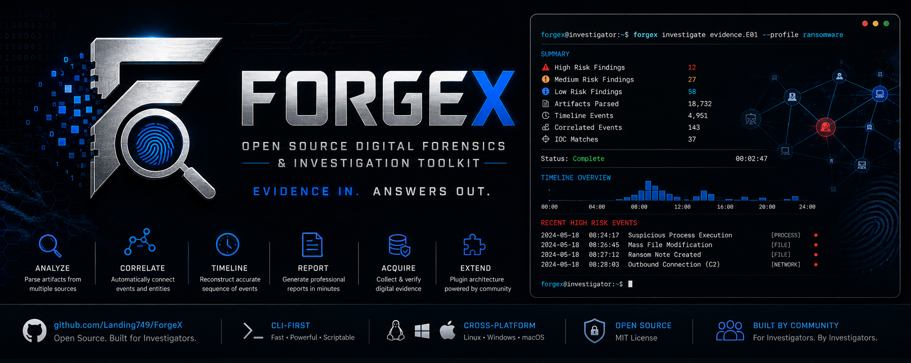

<p align="center">
  
</p>

<div align="center">

[](LICENSE)
[](pyproject.toml)
[](#4-command-reference)
[](#4-command-reference)
[](#8-project-layout)
[](#7-advanced-plugins-config-automation)
[](#11-contributing)
[](#11-contributing)

</div>

# Forgex

Forgex is an open-source DFIR (Digital Forensics & Incident Response) investigation
platform built around evidence correlation, metadata normalization, timeline
reconstruction, and reporting.

```
forgex investigate evidence.E01 --profile ransomware
```

- **Read-only by default** — Forgex never modifies source evidence.
- **Evidence integrity** — every ingest is hashed and chain-of-custody logged; re-verify anytime.
- **Plugin architecture** — commands, parsers, rules, profiles, reports, and threat intel are all extensible.
- **JSON-first** — every command supports `--json`.
- **Cross-platform** — pure-Python core; optional native backends for deep binary-format parsing.
- **Automation-friendly** — scriptable CLI, stable module interfaces, CI-tested.

This README is a full reference: setup, every command with every flag, and
workflows from first-run through advanced plugin/automation usage. Jump to
whichever section matches where you're at:

- [1. Install & Setup](#1-install--setup)
- [2. Core Concepts](#2-core-concepts)
- [3. Beginner: Your First Investigation](#3-beginner-your-first-investigation)
- [4. Command Reference](#4-command-reference)
  - [4.1 `forgex evidence`](#41-forgex-evidence)
  - [4.2 `forgex investigate`](#42-forgex-investigate)
  - [4.3 `forgex report`](#43-forgex-report)
  - [4.4 `forgex disk`](#44-forgex-disk)
  - [4.5 `forgex fs`](#45-forgex-fs)
  - [4.6 `forgex windows`](#46-forgex-windows)
  - [4.7 `forgex network`](#47-forgex-network)
  - [4.8 `forgex util`](#48-forgex-util)
  - [4.9 `forgex plugin`](#49-forgex-plugin)
- [5. Investigation Profiles](#5-investigation-profiles)
- [6. Intermediate Workflows](#6-intermediate-workflows)
- [7. Advanced: Plugins, Config, Automation](#7-advanced-plugins-config-automation)
- [8. Project Layout](#8-project-layout)
- [9. What's Fully Implemented vs. an Extension Point](#9-whats-fully-implemented-vs-an-extension-point)
- [10. System Architecture (Deep Dive)](#10-system-architecture-deep-dive)
- [11. Contributing](#11-contributing)
- [12. Testing](#12-testing)
- [13. Troubleshooting / FAQ](#13-troubleshooting--faq)

---

## 1. Install & Setup

**Requirements:** Python 3.10+.

```bash
# Clone (or unzip) the repo, then from the project root:
pip install -e .                 # core — pure Python, no native deps
pip install -e ".[full]"         # + optional native backends (see below)
pip install -e ".[dev]"          # + test/lint tooling (pytest, ruff)
```

This registers a `forgex` console command via the `forgex` entry point
(`cli.main:app`). After install, confirm it's on your PATH:

```bash
forgex --help
```

If you'd rather not install it globally, you can always run it as a module
from the repo root without installing:

```bash
python -m cli.main --help
```

### What `[full]` adds

Forgex's core works with **zero native dependencies**. The `full` extra pulls
in optional packages that unlock deeper/faster parsing where a pure-Python
implementation would be slower, or where Forgex prefers to defer to a
battle-tested library if it's present:

| Package | Unlocks |
|---|---|
| `python-magic` | Better file type identification in `util identify` |
| `yara-python` | Full YARA rule matching (otherwise falls back to the built-in YARA-lite engine) |
| `scapy` | Extended packet decoding |
| `python-registry` | Alternate registry hive parsing path |
| `python-evtx` | Alternate EVTX parsing path |
| `pefile` | Deeper PE header analysis |
| `olefile` | Legacy MS Office (OLE) document parsing |
| `cryptography` | Certificate parsing in `util cert` |
| `Pillow` | Image metadata/EXIF in `util image` |
| `weasyprint` | PDF report rendering (`report --format pdf`) |

None of these are required — Forgex will run and parse most formats without
any of them. Check what's currently available in your environment with:

```bash
forgex util doctor
```

### First-run sanity check

```bash
forgex util doctor --json
```

This prints your Python version, platform, and the install status of every
optional package above. Run this first whenever something behaves
differently than expected — it's the fastest way to tell "bug" from
"missing optional dependency."

---

## 2. Core Concepts

A few ideas that make the rest of this doc click:

- **Case** — a working directory (default `./cases/default`, configurable)
  where Forgex tracks evidence you've added, their hashes, and chain of
  custody. Every `evidence` command operates against this case directory.
- **Evidence item** — something you've added to the catalog (a file, an
  image, a directory). Each gets an `id`, hashes, timestamps, and notes.
- **Investigation** — running a **profile** (a named bundle of modules +
  detection rules) against a **target** (a path, image, or evidence item).
  Produces findings you can render as a report.
- **Profile** — declarative YAML under `profiles/` describing which modules
  to run and which rules to check (e.g. `ransomware`, `quick`, `phishing`).
  You can write your own.
- **Module** — a parser/analyzer for a specific artifact domain: `disk`,
  `filesystem`, `windows`, `linux`, `macos`, `browser`, `network`,
  `malware`, `ioc`.
- **Plugin** — a drop-in `*.py` file that registers new rules, profiles, or
  report formats without touching Forgex's own source.
- **`--json`** — every command that prints output accepts `--json` for
  machine-readable output instead of the human-readable table/text. This
  makes every command scriptable.

---

## 3. Beginner: Your First Investigation

This is the fastest path from "just installed it" to a finished report.

**Step 1 — Check your environment.**

```bash
forgex util doctor
```

**Step 2 — Add evidence to the case catalog.** This hashes the file/folder
and logs it in the chain-of-custody record. It does **not** copy or modify
the source unless you pass `--copy`.

```bash
forgex evidence add ./suspicious_dir --notes "Initial triage"
```

**Step 3 — Confirm it's there, and verify its integrity anytime.**

```bash
forgex evidence list
forgex evidence verify <id>          # <id> is printed by `add` and `list`
```

**Step 4 — Run an investigation.** Pick a profile that matches what you're
looking for (see [section 5](#5-investigation-profiles) for the full list —
`quick` is the fast general-purpose default):

```bash
forgex investigate ./suspicious_dir --profile quick --json
```

**Step 5 — Get a shareable report.** Add `--format` and `-o` to render a
file instead of just printing a JSON summary to your terminal:

```bash
forgex investigate ./suspicious_dir --profile ransomware --format html -o report.html
```

That's the whole loop: `evidence add` → `investigate` → `--format ... -o`.
Everything else in this README is depth on each of those steps, plus the
standalone utilities you'll reach for along the way.

---

## 4. Command Reference

Every command below supports `--json` unless noted otherwise. Run
`forgex <command> --help` or `forgex <group> <command> --help` at any time
for the live, authoritative flag list — this section mirrors it in one
place with explanations.

### 4.1 `forgex evidence`

Evidence catalog, chain of custody, hash verification. Operates against the
current case directory (`case_root` in config, default `./cases/default`).

| Command | Description |
|---|---|
| `forgex evidence add SOURCE [--copy] [--notes TEXT] [--json]` | Hash and catalog `SOURCE` (file or directory). `--copy` copies it into the case directory instead of referencing it in place. `--notes` attaches a free-text note. |
| `forgex evidence list [--json]` | List everything currently in the case catalog. |
| `forgex evidence hash ITEM_ID [--json]` | Re-compute and display the hash(es) for a catalog item. |
| `forgex evidence verify ITEM_ID [--json]` | Re-hash the item and compare against the stored hash. Prints `HASH MISMATCH` and exits with code `2` on failure — safe to use in scripts/CI as an integrity gate. |
| `forgex evidence export ITEM_ID DEST [--json]` | Copy a catalog item out to `DEST`. |

```bash
forgex evidence add ./evidence.E01 --copy --notes "Workstation-07, seized 2026-07-10"
forgex evidence list --json
forgex evidence verify a1b2c3d4
forgex evidence export a1b2c3d4 ./exports/evidence.E01
```

### 4.2 `forgex investigate`

Runs a profile against a target and produces findings.

```bash
forgex investigate TARGET [--profile NAME] [--format FMT] [--output PATH | -o PATH] [--json]
```

| Flag | Default | Notes |
|---|---|---|
| `TARGET` | — | Path, disk image, or directory to investigate. |
| `--profile` | `quick` | One of `quick`, `malware`, `ransomware`, `insider_threat`, `exfiltration`, `persistence`, `phishing`, `custom`, or a plugin-contributed profile name. |
| `--format` | `json` | Report format when `-o` is given — see [`forgex report formats`](#43-forgex-report). |
| `--output` / `-o` | none | If set, writes a rendered report to this path in addition to the summary. |
| `--json` | off | Force JSON summary output even without `-o`. |

If you don't pass `-o`, Forgex always prints a JSON investigation summary to
the terminal so you can see results immediately; `-o` additionally renders
a full report file in your chosen format.

```bash
# Fast triage, summary only
forgex investigate ./case_dir --profile quick

# Full ransomware sweep, HTML report to disk
forgex investigate ./case_dir --profile ransomware --format html -o report.html

# Malware profile, machine-readable output for piping into another tool
forgex investigate ./sample_dir --profile malware --json | jq '.findings'
```

### 4.3 `forgex report`

```bash
forgex report formats [--json]
```

Lists supported report formats: `json`, `markdown`, `html`, `csv`, `pdf`
(`pdf` requires the `weasyprint` optional dependency — see
[section 1](#1-install--setup)). Plugins can register additional formats,
which will also show up here.

### 4.4 `forgex disk`

Disk image analysis (DD/E01/VHD/VHDX/QCOW2/VMDK — see
[section 9](#9-whats-fully-implemented-vs-an-extension-point) for exact
format coverage).

| Command | Description |
|---|---|
| `forgex disk analyze IMAGE [--json]` | High-level analysis of a disk image. |
| `forgex disk partitions IMAGE [--json]` | List the partition table (MBR/GPT). |
| `forgex disk mount IMAGE MOUNTPOINT [--partition N]` | Mount a partition read-only. |
| `forgex disk info IMAGE [--json]` | Image metadata (format, size, sectors, etc). |

```bash
forgex disk info ./evidence.E01
forgex disk partitions ./evidence.E01 --json
forgex disk analyze ./evidence.vhd
```

### 4.5 `forgex fs`

Filesystem operations against a live directory or mounted volume.

| Command | Description |
|---|---|
| `forgex fs tree ROOT [--max-depth N] [--json]` | Recursive directory listing. |
| `forgex fs search ROOT PATTERN [--regex] [--content] [--json]` | Search filenames (or, with `--content`, file contents) for `PATTERN`. `--regex` treats `PATTERN` as a regular expression instead of a glob/substring. |
| `forgex fs timeline ROOT [--out PATH] [--json]` | Build a filesystem timeline (MAC times) for everything under `ROOT`. `--out` writes it to a JSON file instead of printing. |
| `forgex fs deleted VOLUME` | List recoverable deleted file records on a volume. |
| `forgex fs recover VOLUME RECORD_ID DEST` | Recover a deleted file record to `DEST`. |
| `forgex fs ads PATH` | List NTFS Alternate Data Streams on `PATH`. |
| `forgex fs slack VOLUME` | Extract filesystem slack space. |

```bash
forgex fs tree ./extracted_evidence --max-depth 3
forgex fs search ./extracted_evidence "*.ps1" --content --json
forgex fs timeline ./extracted_evidence --out timeline.json
```

### 4.6 `forgex windows`

Windows artifact parsing — implemented natively (no native deps required)
for registry hives, EVTX, MFT, USN Journal, and legacy Prefetch.

| Command | Description |
|---|---|
| `forgex windows registry HIVE_PATH [KEY] [--json]` | Parse a registry hive. Omit `KEY` to dump from the root; pass a key path to drill in. |
| `forgex windows evtx PATH [--max-records N] [--json]` | Parse a `.evtx` event log (default cap: 1000 records). |
| `forgex windows mft PATH [--json]` | Parse an `$MFT` file into individual records. |
| `forgex windows usn PATH [--json]` | Parse a `$UsnJrnl` journal into change records. |
| `forgex windows prefetch PATH [--json]` | Parse a Prefetch (`.pf`) file. |
| `forgex windows lnk PATH [--json]` | Parse a `.lnk` shortcut file. |

```bash
forgex windows registry ./SYSTEM "ControlSet001\Services"
forgex windows evtx ./Security.evtx --max-records 500 --json
forgex windows mft ./\$MFT --json > mft_records.json
forgex windows prefetch ./CHROME.EXE-ABCD1234.pf
```

### 4.7 `forgex network`

Network capture parsing — classic pcap and PCAPNG, plus TLS ClientHello/JA3.

| Command | Description |
|---|---|
| `forgex network summarize PATH [--json]` | High-level capture summary (protocols, hosts, timespan). |
| `forgex network packets PATH [--max-packets N] [--json]` | Decode individual packets (default cap: 1000). |
| `forgex network ja3 CLIENT_HELLO_FILE [--json]` | Compute a JA3 fingerprint from a raw TLS ClientHello. |

```bash
forgex network summarize ./capture.pcapng
forgex network packets ./capture.pcap --max-packets 200 --json
forgex network ja3 ./client_hello.bin
```

### 4.8 `forgex util`

Standalone utilities that don't need a case or investigation — handy for
quick one-off checks on a single file.

| Command | Description |
|---|---|
| `forgex util hash PATH [--json]` | Compute file hashes (algorithms from config, default `sha256` + `md5`). |
| `forgex util identify PATH [--json]` | Identify file type (magic-byte based; better results with `python-magic` installed). |
| `forgex util entropy PATH [--json]` | Shannon entropy of the file — high entropy can indicate encryption/compression/packing. |
| `forgex util strings PATH [--min-length N] [--encoding ENC] [--json]` | Extract printable strings (default min length 4, ASCII). |
| `forgex util hexdump PATH [--offset N] [--length N]` | Hex dump a byte range (default: first 256 bytes from offset 0). |
| `forgex util archive PATH [--json]` | List the contents of an archive file. |
| `forgex util image PATH [--json]` | Image metadata/EXIF (needs `Pillow` for full EXIF support). |
| `forgex util pdf PATH [--json]` | PDF metadata/structure info. |
| `forgex util office PATH [--json]` | Office document metadata (legacy OLE formats need `olefile`). |
| `forgex util cert PATH [--json]` | Parse an X.509 certificate (needs `cryptography` for full detail). |
| `forgex util logs PATH PATTERN [--json]` | Grep a log file for `PATTERN`. |
| `forgex util ioc PATH [--json]` | Extract IOCs (IPs, domains, hashes, emails, etc.) from a text/log file. |
| `forgex util doctor [--json]` | Environment check — Python version, platform, optional dependency status. |

```bash
forgex util hash ./sample.bin
forgex util entropy ./sample.bin
forgex util strings ./sample.bin --min-length 6
forgex util ioc ./browser_history_dump.txt --json
forgex util doctor
```

### 4.9 `forgex plugin`

```bash
forgex plugin list [--json]
```

Loads every plugin from the configured plugin directories (default
`./plugins`) and reports what got registered: loaded plugin files, custom
commands, custom rules, custom profiles, and custom report formats. Use
this after adding/editing a plugin to confirm it registered correctly
before it's in the middle of a real investigation.

---

## 5. Investigation Profiles

Profiles are declarative YAML under `profiles/`, each naming which modules
to run and which detection rules to check. Ship as-is, or copy one as a
starting point for your own.

| Profile | Modules | What it looks for |
|---|---|---|
| `quick` | `filesystem`, `metadata` | Fast triage pass — filesystem metadata, entropy anomalies, basic timeline. Good default first pass on anything. |
| `malware` | `malware`, `filesystem` | PE/ELF/Mach-O header analysis, strings/entropy, optional YARA scan. |
| `ransomware` | `filesystem`, `metadata` | Mass file encryption signals — entropy spikes, mass extension renames, ransom note detection. |
| `insider_threat` | `windows`, `filesystem`, `browser` | USB history, large file access/copy patterns, off-hours activity. |
| `exfiltration` | `network`, `browser`, `filesystem` | Outbound network activity, cloud storage/browser uploads, archive creation. |
| `persistence` | `windows`, `macos`, `linux` | Autoruns — services, scheduled tasks, LaunchAgents, registry Run keys. |
| `phishing` | `browser`, `malware`, `ioc` | Email headers, browser history around click time, downloaded payloads. |
| `custom` | (empty) | Blank template — start here for your own profile. |

Every profile also runs `scope_summary`, a baseline rule giving an overview
of what was scanned.

**Writing your own profile:** copy `profiles/custom.yaml` and fill in
`modules` (any of `disk`, `filesystem`, `windows`, `linux`, `macos`,
`browser`, `network`, `malware`, `ioc`) and `rules` (built-in rule names, or
any you've registered via a plugin — see [section 7](#7-advanced-plugins-config-automation)):

```yaml
name: my_custom_sweep
description: Off-hours access plus archive creation, nothing else.
modules: [filesystem, browser]
rules: [scope_summary, off_hours_access, archive_creation]
```

Save it under `profiles/`, then use it directly:

```bash
forgex investigate ./target --profile my_custom_sweep
```

---

## 6. Intermediate Workflows

**Full triage-to-report pipeline:**

```bash
forgex evidence add ./extracted_evidence --copy --notes "USB dump from workstation-07"
forgex evidence list --json
forgex evidence verify <evidence-id>
forgex investigate ./extracted_evidence --profile quick --format markdown -o report.md
```

**Ransomware triage with an HTML report:**

```bash
forgex investigate ./extracted_evidence --profile ransomware --format html -o ransomware_report.html
```

**Pull IOCs out of a browser history export or log file:**

```bash
forgex util ioc ./browser_history_export.txt --json
```

**Inspect a suspicious binary end-to-end:**

```bash
forgex util identify ./sample.bin
forgex util entropy ./sample.bin
forgex util strings ./sample.bin --min-length 6
```

or, from Python, using the analyzer module directly for a single combined
result object:

```python
from modules.malware.analyzer import analyze
print(analyze("./sample.bin"))
```

**Chaining commands for automation.** Since every command supports
`--json`, you can pipe Forgex output straight into `jq`, log it, or feed it
into another tool:

```bash
forgex investigate ./target --profile malware --json \
  | jq '.findings[] | select(.severity == "high")'
```

**Using `verify` as an integrity gate in CI/scripts.** `evidence verify`
exits `2` on hash mismatch, so it composes cleanly with `&&` / exit-code
checks:

```bash
forgex evidence verify <id> && echo "integrity OK" || echo "INTEGRITY FAILURE"
```

**Parsing Windows artifacts and correlating them yourself.** Combine
`windows mft`, `windows usn`, and `windows evtx` on the same volume, then
diff/join the JSON output by timestamp for a manual timeline:

```bash
forgex windows mft ./\$MFT --json > mft.json
forgex windows usn ./\$UsnJrnl --json > usn.json
forgex windows evtx ./Security.evtx --json > security_evtx.json
```

**Building a correlation graph in Python** for entity relationships
(user → process → file, etc.) that go beyond what a profile's flat findings
list gives you:

```python
from core.correlation import CorrelationEngine

g = CorrelationEngine()
g.add_node("user:jdoe", "user", "jdoe")
g.add_node("proc:4821", "process", "powershell.exe")
g.add_node("file:payload", "file", "payload.exe")
g.add_edge("user:jdoe", "proc:4821", "EXECUTED")
g.add_edge("proc:4821", "file:payload", "WROTE")

print(g.related("user:jdoe", max_depth=2))
```

**Parsing browser artifacts directly via the Python API** (when you want
raw records rather than a profile's rolled-up findings):

```python
from modules.browser.artifacts import parse_chrome_history, parse_chrome_downloads

history = parse_chrome_history("/path/to/Default/History")
downloads = parse_chrome_downloads("/path/to/Default/History")
```

---

## 7. Advanced: Plugins, Config, Automation

### Global configuration (`config.yaml`)

```yaml
case_root: "./cases"

theme: "default"

hash_algorithms:
  - sha256
  - md5

report:
  default_formats: ["json", "markdown"]
  include_severity: true
  include_confidence: true

plugins:
  directories:
    - "./plugins"
  enabled: true

profiles:
  directory: "./profiles"

logging:
  level: "INFO"
  file: null
```

Common tweaks:
- Point `case_root` at a shared/network location for a team case.
- Add algorithms to `hash_algorithms` (e.g. `sha1`) if your chain-of-custody
  requirements call for it.
- Add more directories to `plugins.directories` to load plugins from
  multiple locations (e.g. a shared org-wide plugin repo plus a local one).
- Set `logging.file` to a path to persist logs instead of stdout-only.

### Writing a plugin

Forgex loads every `*.py` file in the configured plugin directories that
defines a top-level `register(registry)` function. A plugin can contribute
a custom **rule**, a custom **profile**, and/or a custom **report format**
in one file. `plugins/example_plugin.py` is a full working reference:

```python
"""Example Forgex plugin."""
from __future__ import annotations

import uuid
from typing import Any


def rule_many_small_files(ctx: dict[str, Any]) -> list:
    """Flag directories with an unusually large number of very small
    files — can indicate a staged exfiltration bundle or a fragmented
    artifact cache."""
    from core.investigation import Finding

    small_files = [fm for fm in ctx["metadata"] if fm.size_bytes < 1024]
    if len(small_files) > 500:
        return [Finding(
            id=uuid.uuid4().hex[:10],
            title="Large number of small files detected",
            severity="low",
            confidence="low",
            description=f"{len(small_files)} files under 1KB were found under {ctx['target']}.",
            evidence_refs=[fm.path for fm in small_files[:10]],
            module="plugin.example_plugin",
            tags=["heuristic", "example"],
        )]
    return []


CUSTOM_PROFILE = {
    "name": "example_custom",
    "description": "Example plugin-contributed investigation profile.",
    "modules": ["filesystem"],
    "rules": ["many_small_files"],
}


def report_format_summary_txt(result) -> str:
    """One-paragraph plaintext summary report format, registered as
    'summary_txt'."""
    return (
        f"Forgex case {result.case_id} ({result.profile} profile) scanned "
        f"{result.stats.get('files_scanned', 0)} files under {result.target} "
        f"and produced {len(result.findings)} findings."
    )


def register(registry) -> None:
    registry.add_rule("many_small_files", rule_many_small_files)
    registry.add_profile("example_custom", CUSTOM_PROFILE)
    registry.add_report_format("summary_txt", report_format_summary_txt)
```

**Rule contract:** a rule function receives a `ctx` dict (at minimum
`ctx["metadata"]` — the list of file metadata objects scanned, and
`ctx["target"]` — the investigation target) and returns a list of
`Finding` objects (empty list if nothing triggered).

**Profile contract:** a dict with `name`, `description`, `modules` (list of
module names to run), and `rules` (list of rule names to evaluate — either
built-in or plugin-registered).

**Report format contract:** a function taking the `InvestigationResult` and
returning a string (or bytes, for binary formats) — registered under
whatever name you pass to `add_report_format`, then usable via
`--format <name>` just like the built-in formats.

Drop your file in `plugins/` (or another directory listed under
`plugins.directories` in `config.yaml`), then confirm it loaded:

```bash
forgex plugin list --json
```

Use your new pieces immediately:

```bash
forgex investigate ./target --profile example_custom --format summary_txt -o out.txt
```

### Automation notes

- Every command's `--json` output is stable and intended for scripting —
  build wrappers/dashboards against it directly rather than parsing table
  output.
- `evidence verify` (exit code `2` on failure) and the `NotImplementedError`
  → exit code `3` convention (used by extension-point commands like
  `disk mount`, `fs deleted/recover/ads/slack` on unsupported formats) are
  both safe, meaningful exit codes to branch on in CI/scripts.
- The CLI is a thin `typer` app over the `core`/`modules` Python packages —
  anything the CLI does, you can call directly from Python for tighter
  integration (see the Python API snippets throughout
  [section 6](#6-intermediate-workflows)).

---

## 8. Project Layout

```
cli/            CLI entry point (Typer)
core/           Evidence, Metadata, Correlation, Timeline, Investigation,
                Report engines + Plugin Manager + Config
modules/        disk, filesystem, windows, linux, macos, browser,
                network, malware, ioc
plugins/        drop-in *.py plugins (see plugins/example_plugin.py)
profiles/       investigation profile YAML definitions
rules/          YARA / detection rule files
reports/        report output landing directory
docs/           documentation (see docs/ARCHITECTURE.md)
examples/       example evidence / usage
tests/          pytest suite
```

> **Note on repo layout:** the spec's directory name `cmd/` collides with
> Python's standard library `cmd` module (used by `pdb`, `argparse`, etc.),
> which breaks tooling like pytest when the repo root is on `sys.path`. This
> implementation uses `cli/` instead, keeping every other directory name
> exactly as specified.

---

## 9. What's Fully Implemented vs. an Extension Point

Forgex's core (Evidence, Metadata, Timeline, Correlation, Investigation,
Report engines, Plugin Manager, CLI) works with **zero native
dependencies**, and so does almost everything that used to require optional
packages:

- **Windows**: Registry hives (regf), EVTX (binary XML, incl.
  templates/substitutions), MFT, USN Journal, Prefetch (legacy
  uncompressed; Win10+ MAM container detected but Xpress-Huffman payload
  decompression is a documented extension point — see
  `modules/windows/prefetch.py`), LNK. Shimcache and Jump Lists remain
  extension points.
- **Disk images**: E01/EWF1 (section framing + table/sectors chunk
  reconstruction), VHD (fixed disks), MBR + GPT partition tables. VHD
  dynamic/differencing, VHDX, QCOW2, and VMDK remain extension points (see
  `modules/disk/analyze.py` docstring for exactly why).
- **Network**: classic pcap and PCAPNG framing, IPv4/TCP/UDP/DNS decode,
  TLS ClientHello parsing + JA3 fingerprinting. Full HTTP stream
  reassembly remains an extension point.
- **Malware**: PE/ELF/Mach-O headers, a self-contained "YARA-lite" rule
  engine (documented subset of YARA syntax) used automatically when
  `yara-python` isn't installed.
- **macOS/Linux/Browser/IOC**: fully natively implemented.

A few formats are undocumented/proprietary enough (macOS Unified Logs,
Spotlight) that a from-scratch reimplementation risks *silently* producing
wrong output on real evidence, which is worse than an honest gap in a
forensics tool — those raise a clear `NotImplementedError` naming the
recommended real-world approach instead.

Every native parser in the list above was validated against a
hand-constructed synthetic file matching the real binary layout (see
`tests/`), not just written from memory and assumed correct.

---

## 10. System Architecture (Deep Dive)

This section is for anyone who wants to understand how the pieces actually
fit together well enough to extend or contribute to them — not just call
them from the CLI. Read this before you make a non-trivial change.

### 10.1 The engines, and how data flows between them

Forgex has no database and no server — every engine is a plain Python class
operating on files/dataclasses on disk. `cli/main.py` is a thin `typer`
wrapper that instantiates engines and prints their output; almost nothing
lives in the CLI layer itself, which is why every engine below is equally
usable from a Python script or notebook (see the API snippets in
[section 6](#6-intermediate-workflows)).

```
                     ┌────────────────┐
   evidence add ───► │ EvidenceEngine │──► case_dir/catalog.json
                     └────────────────┘    (hashes + chain of custody)

                     ┌────────────────┐     ┌─────────────────┐
   investigate  ───► │ Investigation  │───► │ MetadataEngine   │ (per file:
                     │ Engine         │     │ (walk_metadata)  │  hash, entropy,
                     │                │     └─────────────────┘  timestamps, EXIF)
                     │  - loads a     │             │
                     │    Profile     │             ▼
                     │    (yaml)      │     ┌─────────────────┐
                     │  - builds ctx  │───► │ TimelineEngine   │ (merges every
                     │  - runs Rules  │     │                  │  timestamp into
                     │  - collects    │     └─────────────────┘  one chronology)
                     │    Findings    │
                     │                │     ┌─────────────────┐
                     │                │───► │ CorrelationEngine│ (typed node/edge
                     └───────┬────────┘     │                  │  graph: file,
                             │               └─────────────────┘  process, user...)
                             ▼
                     InvestigationResult
                    (findings + timeline + graph + stats)
                             │
                             ▼
                     ┌────────────────┐
   report generate ► │  ReportEngine  │──► json / markdown / html / csv / pdf
                     └────────────────┘
```

Everything upstream of `ReportEngine` is pure data — `InvestigationResult`
holds a `TimelineEngine` and a `CorrelationEngine` as-is, so a report
renderer (built-in or plugin) can walk the full timeline and graph, not
just the flat findings list.

### 10.2 Engine responsibilities, in code terms

| Engine | File | What it actually holds/does |
|---|---|---|
| `EvidenceEngine` | `core/evidence.py` | Owns one case directory. `catalog.json` is the single source of truth: a list of `EvidenceItem` dataclasses, each with `hashes`, `custody` (a list of `CustodyEvent`, append-only), and `verified`. Writes are atomic (`write to .tmp, then replace()`). `add()` never touches the source file unless `copy_into_case=True`. |
| `MetadataEngine` | `core/metadata.py` | Stateless per-file extractor: `extract(path)` → one `FileMetadata` (hashes, Shannon entropy over up to the first 4 MiB, normalized MAC(b) timestamps, EXIF/GPS if `Pillow` is present and the file is an image). `walk_metadata(root)` is a generator wrapping this over an `os.walk`. |
| `TimelineEngine` | `core/timeline.py` | A flat, in-memory list of `TimelineEvent`s from any source. `ingest_metadata()` is the built-in adapter that turns `FileMetadata` timestamps into events; any module can call `add_event`/`add_events` directly with its own `TimelineEvent`s (registry key writes, EVTX logins, browser visits, ...). `merged()` sorts by parsed timestamp (malformed timestamps sort first instead of crashing the merge). |
| `CorrelationEngine` | `core/correlation.py` | A dependency-free adjacency-list graph. Nodes must be one of a fixed `NODE_TYPES` set (`user`, `process`, `file`, `registry`, `browser`, `network`, `usb`, `malware`, `persistence`) — this is intentionally closed so every module speaks the same vocabulary. `related(node_id, max_depth)` does a BFS and returns a subgraph. `to_networkx()` is an opt-in escape hatch for consumers that want real graph algorithms. |
| `InvestigationEngine` | `core/investigation.py` | The orchestrator. `load_profile(name)` reads `profiles/<name>.yaml` (or falls back to a built-in default). `run(target, profile)` walks metadata, feeds the `TimelineEngine`, adds one graph node per file, builds a `ctx` dict (`target`, `metadata`, `profile`), and runs every rule in `DEFAULT_RULES` (plus any `extra_rules` passed in) against `ctx`, collecting `Finding`s. |
| `ReportEngine` | `core/report.py` | Pure rendering: takes an `InvestigationResult` and a format name, returns/writes text (or bytes for PDF). HTML is a single Jinja2 template string embedded in the file (no external template files to manage); Markdown/CSV/JSON are hand-built from `to_summary_dict()`. `pdf` renders HTML first, then shells out to `weasyprint` if installed — if it isn't, it tells you exactly what to install rather than silently downgrading. |
| `PluginManager` | `core/plugin_manager.py` | `discover()` globs `*.py` in each configured plugin directory (skipping `_`-prefixed files); `load_all()` imports each one via `importlib.util` under a synthetic module name (`forgex_plugin_<stem>`) and calls its `register(registry)`. A `PluginRegistry` is just six dicts (`commands`, `parsers`, `rules`, `profiles`, `reports`, `threat_intel`) plus a `loaded_plugins` list — see [7](#7-advanced-plugins-config-automation) for the contract each dict expects. A plugin that raises on import is caught, warned to stderr, and skipped — one broken plugin never takes down the CLI. |
| `Config` | `core/config.py` | Loads `config.yaml` merged over hardcoded defaults, exposed via a small `get(key, default)` with dotted-path lookup (e.g. `cfg.get("plugins.directories")`). |

### 10.3 Rules and Findings — the actual mechanics

A **rule** is any callable `ctx -> list[Finding]`. `ctx` currently carries
`target`, `metadata` (the full list of `FileMetadata` for the run), and
`profile`. Two rules ship in `core/investigation.py` itself —
`rule_note_scan_scope` (always emits one `info`-severity summary finding)
and `rule_large_high_entropy_files` (flags a cluster of ≥5 files with
entropy ≥ 7.5 and size > 4KB — a ransomware/packing heuristic) — and both
run on **every** investigation regardless of profile, via `DEFAULT_RULES`.

**Important nuance for contributors:** a profile's YAML `rules:` list (e.g.
`ransomware.yaml` naming `ransom_note_detection`) is currently
*documentation of intent* for that profile, not something
`InvestigationEngine.run()` reads and dispatches on — `run()` always
executes `DEFAULT_RULES` plus whatever you explicitly pass as
`extra_rules=[...]`, and the CLI's `investigate` command doesn't currently
load plugin-registered rules or filter by the profile's declared rule
names either. In other words: today, the profile's `modules`/`rules`
fields describe *scope*, but the two built-in rules run unconditionally,
and wiring a profile's declared rule set (plus any plugin-contributed
rules from `PluginManager`) into `InvestigationEngine.run()` is a genuine,
well-scoped, high-value contribution — see
[11.4](#114-good-first-contributions) below. If you take this on, the
natural shape is: `run()` accepts a `PluginRegistry` (or loads one itself),
resolves `profile["rules"]` names against `DEFAULT_RULES` + the registry's
`rules` dict, and runs only that resolved set instead of the hardcoded
list — with the two current rules re-registered under their `scope_summary`
/ `entropy_cluster` names so every existing profile YAML keeps working
unchanged.

### 10.4 The plugin contract, precisely

A plugin file must define a module-level `register(registry: PluginRegistry) -> None`.
Inside it, you call zero or more of:

```python
registry.add_command(name: str, typer_app: typer.Typer)   # merged into the CLI (wiring point — see 11.4)
registry.add_parser(name: str, fn: Callable)               # convention only; modules/ don't currently look these up automatically
registry.add_rule(name: str, fn: Callable[[dict], list])   # ctx -> list[Finding]
registry.add_profile(name: str, profile: dict)              # {"name", "description", "modules", "rules"}
registry.add_report_format(name: str, fn: Callable)         # InvestigationResult -> str | bytes
registry.add_threat_intel(name: str, fn: Callable)          # convention only; no built-in consumer yet
```

`add_rule`, `add_profile`, and `add_report_format` are the three that are
fully wired end-to-end today (`report --format <plugin_name>` and
`forgex plugin list` both reflect them immediately). `add_command`,
`add_parser`, and `add_threat_intel` register cleanly into the registry
right now but don't yet have a consumer that automatically acts on them —
that consumer is exactly the kind of gap called out in
[11.4](#114-good-first-contributions).

### 10.5 Why the module layer has no base class

Every artifact module (`modules/windows`, `modules/network`, ...) exposes
plain functions and dataclasses instead of implementing a shared
`BaseParser` interface. This is deliberate: it means a plugin — or your own
script — can `from modules.windows.mft import parse_mft_file` and use
exactly the one parser it needs, with no framework machinery, no required
subclassing, and no risk that pulling in one parser drags in every OS
module's dependencies. The tradeoff is that there's no automatic
"run every applicable module against this target" dispatch table; that
dispatch currently happens by hand, in each profile's `modules:` list being
descriptive, and in `InvestigationEngine.run()`'s direct call to
`walk_metadata()`. Extending `run()` to actually dispatch across
`modules/` based on a profile's declared module list (rather than only ever
running `MetadataEngine`) is the other major "the wiring described in the
docs doesn't fully exist in code yet" gap — see below.

### 10.6 A note on `docs/ARCHITECTURE.md`

The repo also ships `docs/ARCHITECTURE.md`, written earlier in the
project's life. It's still useful for the *reasoning* behind the
`NotImplementedError` convention and the general shape of `modules/`, but
some specifics in it are stale — e.g. it describes Windows Registry/EVTX
parsing as gated behind the optional `python-registry`/`python-evtx`
packages, when `modules/windows/registry_native.py` (308 lines) and
`modules/windows/evtx_native.py` (447 lines) now implement both natively,
with zero dependencies, exactly as described in
[section 9](#9-whats-fully-implemented-vs-an-extension-point) of this
README. If the two documents disagree, trust this README and the code
over `docs/ARCHITECTURE.md` — and, ideally, send a PR updating it to match
(see below).

---

## 11. Contributing

Contributions are welcome at every level: new parsers, new rules, new
profiles, new report formats, bug fixes, tests, and documentation. This
section is the practical "how do I actually get a change merged" guide.

### 11.1 Setup for contributors

```bash
git clone <your fork>
cd forgex
pip install -e ".[dev,full]"     # dev tooling + every optional parser backend
```

Run the full check locally before opening a PR — it's exactly what CI runs
(`.github/workflows/ci.yml`), on Python 3.10, 3.11, and 3.12:

```bash
ruff check .
pytest tests/ -v --cov=core --cov=modules --cov=cli --cov-report=term-missing
python -m build          # confirm the package actually builds
forgex --help && forgex util doctor --json   # smoke test the installed CLI
```

### 11.2 Where your change probably goes

| You want to... | Touch this |
|---|---|
| Fix or extend a binary format parser (MFT, EVTX, registry, prefetch, pcap, ...) | The relevant file under `modules/<domain>/`, plus a matching test in `tests/` |
| Add a new detection heuristic | A new `rule_*` function — either alongside `DEFAULT_RULES` in `core/investigation.py` if it's broadly useful, or as a plugin rule in `plugins/` if it's specific/experimental |
| Add a new investigation profile | A new `profiles/<name>.yaml` — no code change needed at all (see [section 5](#5-investigation-profiles)) |
| Add a new report output format | `core/report.py` for a built-in format, or a plugin's `add_report_format` for anything niche/opinionated |
| Add a new CLI command/flag | `cli/main.py` — keep the pattern: thin function, delegate immediately to a `core`/`modules` call, support `--json` via `_emit()` |
| Fix stale docs | `README.md` (this file) and/or `docs/ARCHITECTURE.md` — see [10.6](#106-a-note-on-docsarchitecturemd) |
| Wire the plugin/profile rule-dispatch gap | See [11.4](#114-good-first-contributions) below — this is the single highest-leverage contribution available right now |

### 11.3 Conventions to follow

- **No native build dependencies in core.** Anything in `core/` or the
  base install must work with only the packages listed under
  `[project.dependencies]` in `pyproject.toml`. Anything requiring a
  compiled/native library goes behind a `try: import X / except ImportError`
  guard and into the `[full]` extra in `pyproject.toml`, following the
  existing pattern in `core/metadata.py`'s `_try_extract_exif` and
  `core/utils.py`'s `doctor()`.
- **Never guess a binary format.** Every existing native parser
  (`modules/windows/mft.py`, `registry_native.py`, `evtx_native.py`,
  `modules/disk/ewf.py`, `modules/network/pcap.py`, etc.) was validated
  against a **hand-constructed synthetic file matching the real binary
  layout**, with that construction logic living in the corresponding test
  file — not written from memory and assumed correct. If you can't build a
  synthetic fixture that matches the real spec, and reimplementing risks
  silently misparsing real evidence, raise a clear `NotImplementedError`
  naming the recommended real-world tool/package instead (see
  [section 9](#9-whats-fully-implemented-vs-an-extension-point) and
  `docs/ARCHITECTURE.md` for the reasoning and prior art).
- **Read-only, always.** No code path should ever write to, truncate, or
  modify a path the user passed in as evidence/target. `EvidenceEngine.add`
  only copies *into* the case directory when `--copy` is explicit; disk
  mounting is (and must stay) read-only.
- **`--json` on every command.** If you add a CLI command, wire it through
  the existing `_emit(data, json, title=...)` helper in `cli/main.py`
  rather than hand-rolling `console.print`.
- **Dataclasses over dicts for structured results**, with a `to_dict()`
  method, following `FileMetadata`, `Finding`, `EvidenceItem`, `Node`/`Edge`.
  Keeps JSON output and testing consistent across the whole codebase.
- **Exceptions users will actually see should be clear.** `EvidenceCatalogError`,
  `NotImplementedError` with a specific remediation message — not a bare
  `Exception` or a stack trace. The CLI already catches these categories
  and prints them cleanly; match that pattern for new failure modes.
- **Lint clean.** `ruff.toml` defines the project's rules; run `ruff check .`
  before pushing — CI will fail the PR otherwise.

### 11.4 Good first contributions

Ranked roughly by how self-contained they are:

1. **Wire the rule-dispatch gap.** As detailed in
   [10.3](#103-rules-and-findings--the-actual-mechanics), a profile's
   declared `rules:` list currently doesn't actually filter which rules run.
   Making `InvestigationEngine.run()` resolve and run a profile's declared
   rules (built-in + plugin-registered) instead of the hardcoded
   `DEFAULT_RULES` is scoped, testable, and immediately makes every
   existing profile YAML meaningfully different from every other one.
2. **Wire module dispatch.** `run()` currently only ever calls
   `walk_metadata()` regardless of a profile's `modules:` list (see
   [10.5](#105-why-the-module-layer-has-no-base-class)). Teaching it to
   also run `modules/windows`, `modules/network`, etc. when a profile
   declares them (and feed their output into the same `TimelineEngine`/
   `CorrelationEngine`) is the natural next step after #1.
3. **New rules.** Anything in `profiles/*.yaml`'s `rules:` lists that
   doesn't have a matching `rule_*` function yet is a concrete, well-named
   gap: `ransom_note_detection`, `usb_activity`, `off_hours_access`,
   `archive_creation`, `external_ip_contact`, `suspicious_binary_location`,
   `persistence_mechanism_detected`, `suspicious_url`, `payload_download`.
   Each is small, testable in isolation with a synthetic `ctx`, and
   directly improves an existing profile.
4. **Extension-point parsers.** Anything currently raising
   `NotImplementedError` — Shimcache, Jump Lists, VHD
   dynamic/differencing, VHDX, QCOW2, VMDK, full HTTP stream reassembly —
   is documented (see [section 9](#9-whats-fully-implemented-vs-an-extension-point))
   with a pointer to why it's hard and what the recommended real-world
   approach is. Picking one off is a self-contained, well-specified unit
   of work.
5. **New report formats or profiles.** Lowest-friction entry point — no
   core code changes required at all, just a new file (see
   [5](#5-investigation-profiles) and [7](#7-advanced-plugins-config-automation)).
6. **`docs/ARCHITECTURE.md` refresh.** Bring it back in sync with the
   codebase (see [10.6](#106-a-note-on-docsarchitecturemd)) — genuinely
   useful and very approachable if you're still learning the codebase
   yourself, since it forces you to verify every claim against the source.

### 11.5 PR checklist

- [ ] `ruff check .` passes
- [ ] `pytest tests/ -v` passes, and you added a test for new behavior
  (a hand-constructed synthetic fixture for any new binary parser — see
  11.3)
- [ ] New CLI commands support `--json` and follow the `_emit()` pattern
- [ ] No new hard (non-optional) dependency was added to
  `[project.dependencies]` in `pyproject.toml` — new native/heavy deps go
  in `[project.optional-dependencies.full]` behind an `ImportError` guard
- [ ] Docs updated if behavior, flags, or profiles changed — this README
  is the canonical reference, so command tables, profile tables, and the
  architecture section above should stay accurate
- [ ] Read-only guarantee preserved — nothing writes to a user-supplied
  evidence/target path without an explicit opt-in flag

---

## 12. Testing

```bash
pip install -e ".[dev]"
pytest tests/ -v
```

The test suite covers every native parser (MFT, EVTX, registry, USN,
Prefetch, EWF/E01, VHD, partitions, pcap, JA3, YARA-lite) plus the core
engines (Evidence, Metadata, Timeline, Correlation, Investigation report
generation, IOC extraction). Lint config is in `ruff.toml`; CI runs on
every push across Python 3.10–3.12, including a package build and a CLI
smoke test (see `.github/workflows/ci.yml`).

For coverage detail while working on a specific area:

```bash
pytest tests/test_mft.py -v                          # one file
pytest tests/ -v --cov=modules.windows --cov-report=term-missing   # one module's coverage
```

When contributing a new parser or module, follow the existing pattern:
validate against a hand-constructed synthetic file matching the real
binary layout (not just a sample you assume is representative), and add
the test alongside it in `tests/`.

---

## 13. Troubleshooting / FAQ

**`forgex: command not found` after install.**
Make sure your Python scripts directory is on `PATH`, or run
`python -m cli.main ...` instead of `forgex ...`.

**A command exits with a yellow message and code `3`.**
That's an intentional `NotImplementedError` for a documented extension
point (e.g. `disk mount` on an unsupported image format, `fs deleted` on
an unsupported filesystem) — not a crash. Check the message for the
specific gap and the recommended workaround; see
[section 9](#9-whats-fully-implemented-vs-an-extension-point).

**Something needs a package I don't have installed.**
Run `forgex util doctor` to see exactly which optional packages are
missing, then `pip install -e ".[full]"` (or install the specific package)
to unlock that path.

**A report format I want isn't listed.**
Run `forgex report formats` to see what's currently registered — built-in
formats are `json`, `markdown`, `html`, `csv`, `pdf` (`pdf` needs
`weasyprint`); plugins can register more (see
[section 7](#7-advanced-plugins-config-automation)).

**My plugin isn't showing up.**
Run `forgex plugin list --json` — confirm your file is in a directory
listed under `plugins.directories` in `config.yaml`, and that it defines a
top-level `register(registry)` function.

**Where does `--json` output go if I also pass `-o`?**
`investigate` always prints the JSON summary to your terminal (unless you
suppress it) *and* separately writes the full rendered report to the `-o`
path in your `--format`. They're not the same content — the terminal
summary is a quick-glance overview; the file is the full report.

---

<p align="center">
  
</p>

<p align="center"><strong>Evidence in. Answers out.</strong></p>

<p align="center">
  <a href="https://github.com/Landing749/ForgeX">github.com/Landing749/ForgeX</a> &middot;
  Open Source. Built for Investigators.
</p>

## License

MIT — see `LICENSE`.
